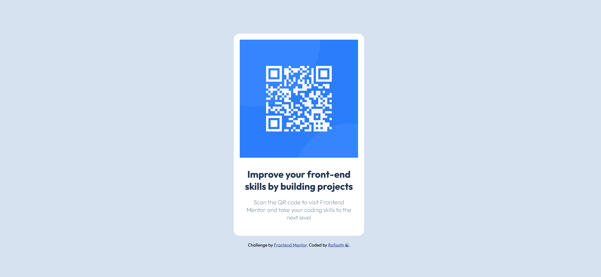

# Frontend Mentor - QR code component solution

This is a solution to the [QR code component challenge on Frontend Mentor](https://www.frontendmentor.io/challenges/qr-code-component-iux_sIO_H).

## Table of contents

- [Overview](#overview)
  - [Screenshot](#screenshot)
  - [Links](#links)
- [My process](#my-process)
  - [Built with](#built-with)
  - [What I learned](#what-i-learned)
  - [Continued development](#continued-development)
  - [Useful resources](#useful-resources)
- [Author](#author)

## Overview

### Screenshot



### Links

- Solution URL: [Github](https://your-solution-url.com)
- Live Site URL: [qr-code](https://your-live-site-url.com)

## My process

### Built with

- Semantic HTML5 markup
- CSS custom properties

### What I learned

The QR code component challenge is basic html and css project. After various trail and error i have learnt a few more css properties in the process.

Important code snippets:

```html
<div class="wrapper"></div>
```

```css
* {
  padding: 0;
  margin: 0;
  box-sizing: border-box;
}
/* The above code is written in CSS */
```

### Continued development

Cards are quite useful in websites to showcase various projects and ideas. I'am looking forward to add cards to websites.

### Useful resources

- [resource 1](https://stackoverflow.com/questions/56732889/css-display-elements-in-columns) - This helped me for handling the error for the css. I really liked this pattern and will use it going forward.
- [resource 2](https://www.toptal.com/designers/htmlarrows/symbols/) - This is an amazing site for html code symbols.

## Author

- Website - [Rafaath](https://www.your-site.com)
- Frontend Mentor - [@Rafaath11](https://www.frontendmentor.io/profile/yourusername)
- Twitter - [@PixelPop212](https://www.twitter.com/yourusername)
